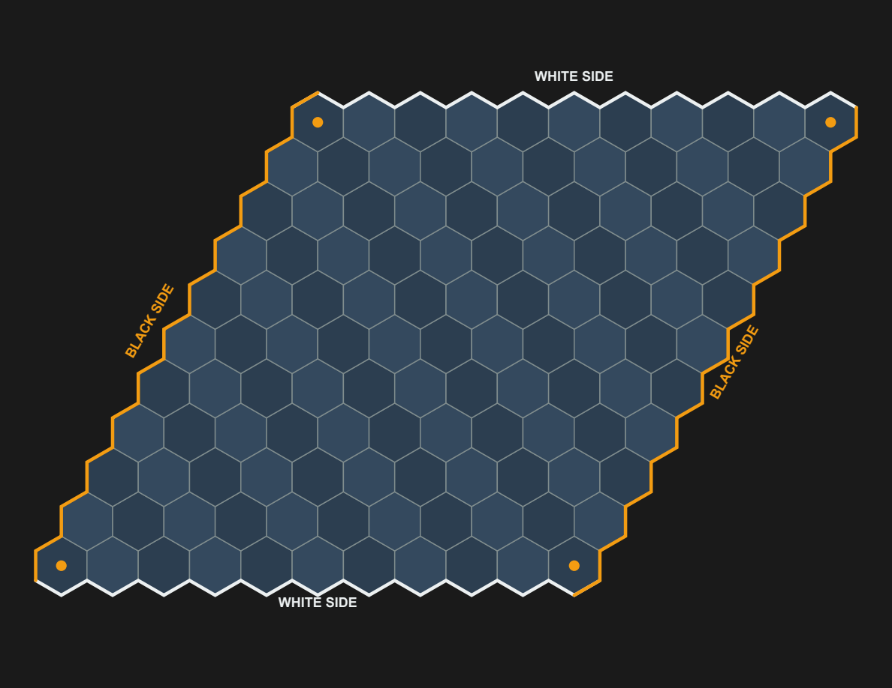
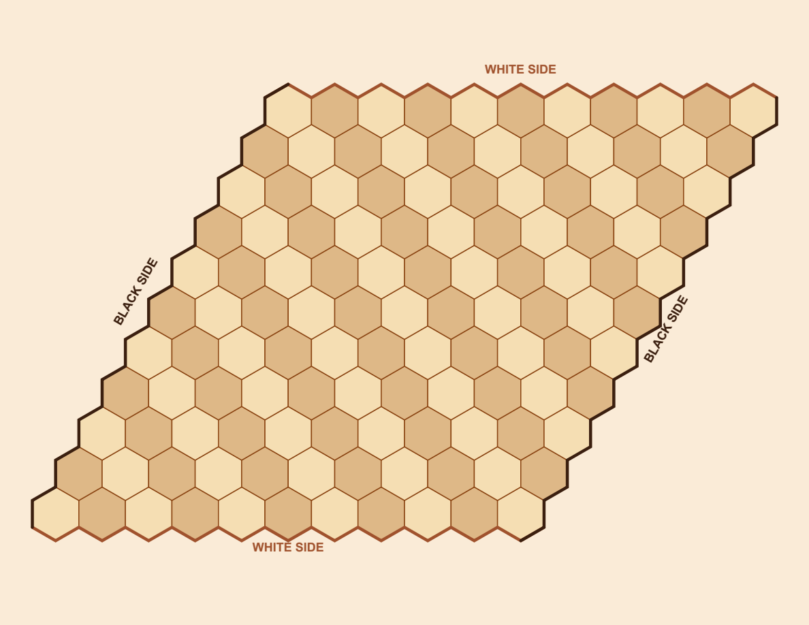
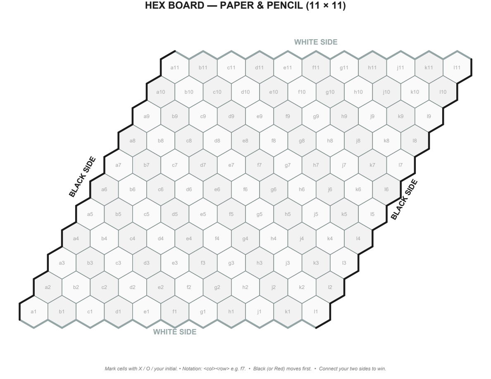
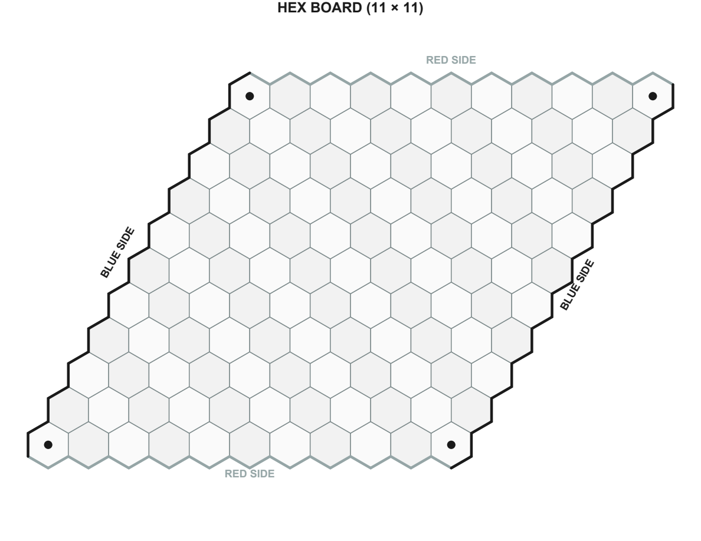
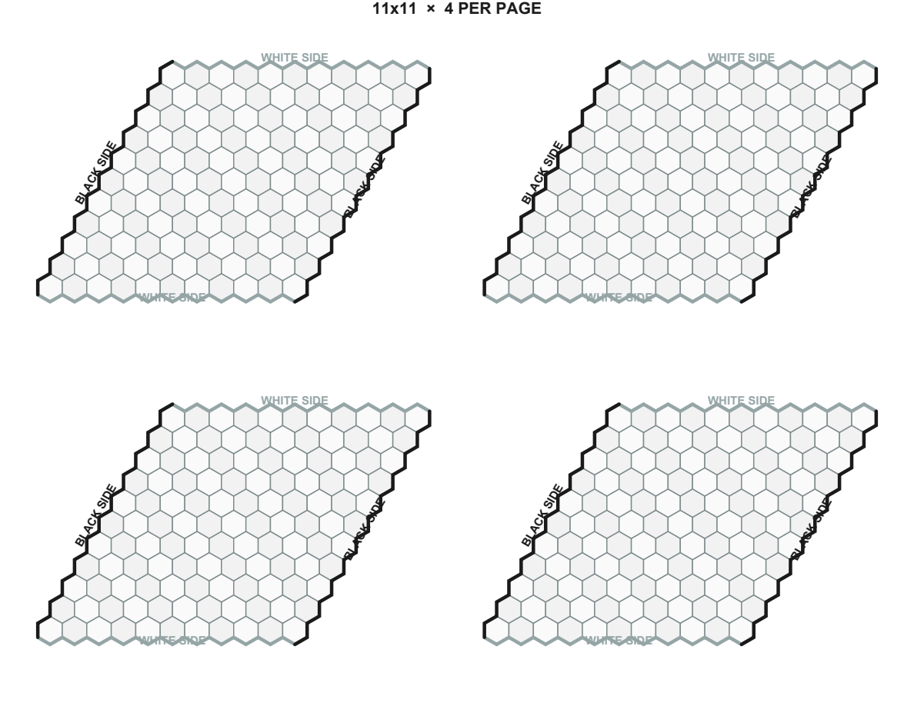
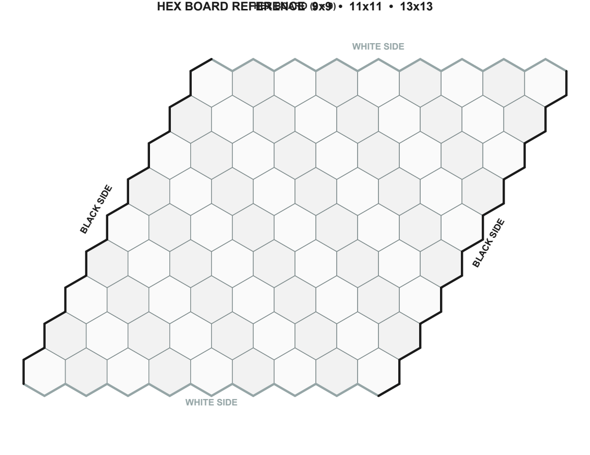
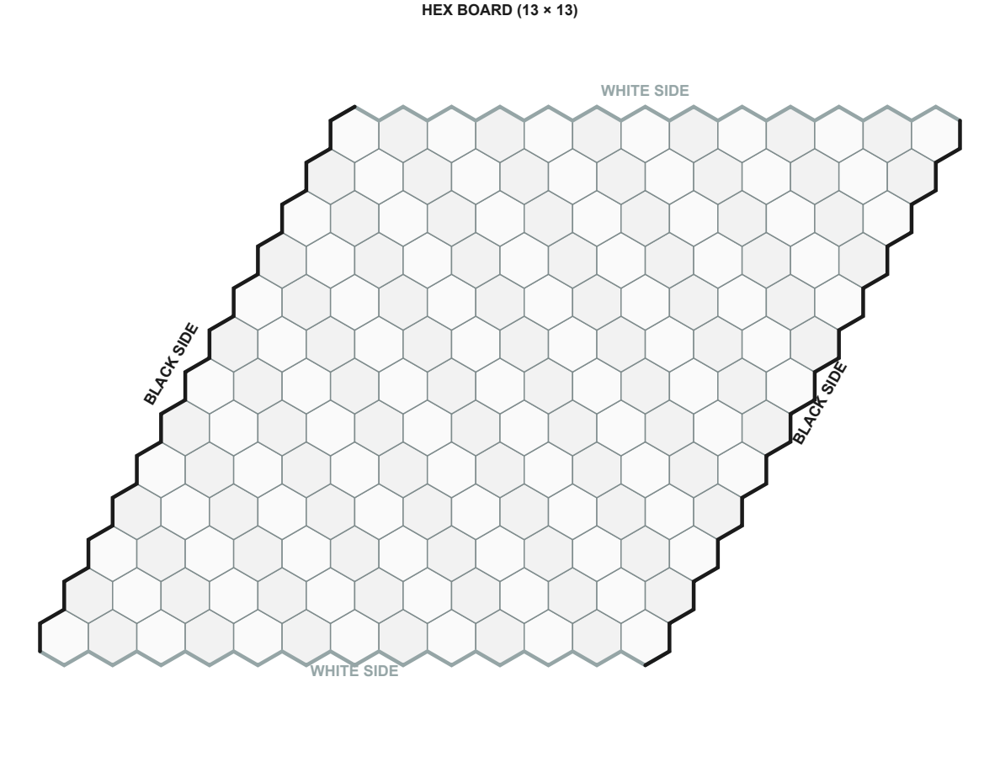
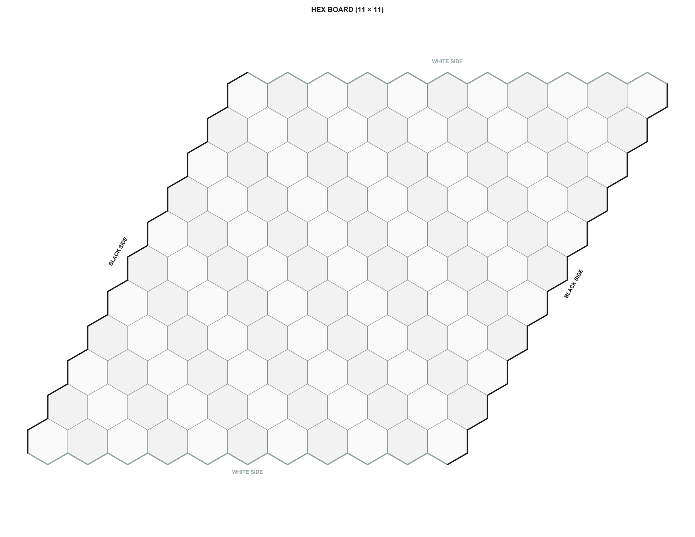
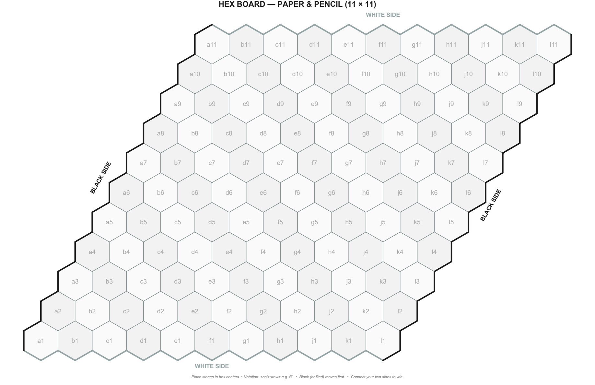
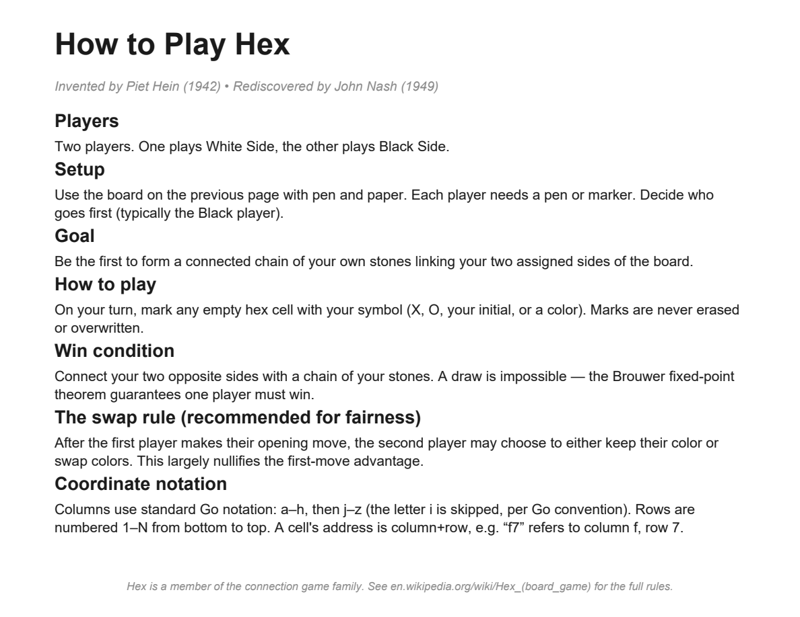

# HEX Board Generator

[](https://github.com/valueforvalue/hex-board-generator/actions/workflows/test.yml)
[](LICENSE)

Generate printable HEX board PDFs sized for Go stones, paper-and-pencil play, or any custom layout.

11×11 is the classic Hex board size. This generator also supports 7×7, 9×9, 13×13, 14×14, 19×19, and any other N×N.

## Quick start

```bash
python generate_board.py 11                          # 11x11 on Letter (default)
python generate_board.py 11 --pen-paper              # paper & pencil mode
python generate_board.py 11 --stone-size 19          # auto-pick paper for 19mm stones
```

## Board sizing notes

| Paper        | Size (in)       | Max hex flat-to-flat | Fits |
|--------------|-----------------|----------------------|------|
| Letter       | 8.5 × 11        | ~16 mm               | Mini stones |
| Legal        | 8.5 × 14        | ~19 mm               | 13mm stones |
| Tabloid      | 11 × 17         | ~25 mm               | 19mm stones |
| A3           | 11.7 × 16.5     | ~26 mm               | 19mm stones |
| ANSI-B       | 17 × 22         | ~32 mm               | 22mm stones (Go standard) |

Stone diameter should be ≤ 70% of hex flat-to-flat for comfortable play.

## Features

### Themes (`--theme`)

| Command | Theme |
|---------|-------|
| `--theme classic` *(default)* | Light gray cells, gray/black bands |
| `--theme light` | Pure white cells, no checkerboard |
| `--theme dark` | Black background, dark blue cells, orange bands |
| `--theme wood` | Beige/brown wood-look, antique-white background |

### Label conventions (`--label-set`)

- `wb` *(default)* — "White Side" / "Black Side" (classic)
- `rb` — "Red Side" / "Blue Side" (modern convention)

### Corner dots (`--corner-dots`)

Marks the four corner hexes with filled circles per Hex board convention. Corner cells belong to both adjacent sides.

### Paper & pencil mode (`--pen-paper`)

- Thicker hex strokes
- Go-style coordinate labels inside each cell (`a`–`h`, `j`–`z` columns; rows `1`–`N`)
- Footer hint: notation, first player, win condition
- With `--stone-size`, instructions adapt for stone play (place stones in hex centers)

### Coordinate labels (`--coords` / `--no-coords` / `--cell-coords`)

- `--coords` / `--pen-paper` — show Go-style labels inside each cell (default for legible boards)
- `--no-coords` — suppress all coordinate labels
- `--cell-coords` — same as `--coords` (kept for clarity)

### Stone play mode (`--stone-mode`)

Auto-enabled when `--stone-size` is given. Tweaks the footer and rules page for stone play instead of pen-and-paper (e.g. "place stones in hex centers" rather than "mark with X/O").

### Fit modes (`--safemode` / `--makeitwork` / `--unsafe`)

- `safemode` *(default)* — stone ≤ 70% of hex flat-to-flat (comfortable)
- `makeitwork` — stone ≤ 85% (tight fit; shrinks margin to 4pt to fill page)
- `unsafe` — stone ≤ 100% (flush; for testing only)

### Multi-board output

| Flag | Output |
|------|--------|
| `--n-up N` | N boards per page (e.g. `--n-up 4` for a 2×2 grid handout) |
| `--pad N` | N copies, one per page (1942 Polygon 50-sheet pad style) |
| `--sizes 9,11,13` | One page per size (reference booklet) |

### Rules sheet (`--rules`)

Append a one-page Hex rules summary at the end of the PDF. Sections cover Players, Setup, Goal, How to play, Win condition, the swap rule, and coordinate notation. Adapts to the chosen `--theme` and `--label-set`.

## Gallery

### Default

```bash
python generate_board.py 11
```


### Dark theme

```bash
python generate_board.py 11 --theme dark --corner-dots
```



### Wood theme

```bash
python generate_board.py 11 --theme wood
```



### Paper & pencil

```bash
python generate_board.py 11 --pen-paper
```



### Red/Blue + corner dots

```bash
python generate_board.py 11 --label-set rb --corner-dots
```



### N-up handout (4 boards per page)

```bash
python generate_board.py 11 --n-up 4
```



### Reference booklet (9×9, 11×11, 13×13)

```bash
python generate_board.py 11 --sizes 9,11,13
```

| 9×9 | 11×11 | 13×13 |
|-----|-------|-------|
|  |  |  |

### Stone play on ANSI-B (auto-picks paper)

```bash
python generate_board.py 11 --stone-size 19
```

Auto-selects ANSI-B (17×22) for 19mm stones with 63% comfortable fit.



### Stone play on Tabloid (11×17, tight fit)

```bash
python generate_board.py 11 --stone-size 19 --paper tabloid --makeitwork --pen-paper --rules
```

Tabloid 11×17 fits an 11×11 board with 19mm stones at 77% ratio (tight, but playable). Instructions auto-switch to stone-mode language.



### Rules sheet (`--rules`)

```bash
python generate_board.py 11 --rules
```

Appends a one-page Hex rules summary at the end of the PDF.



## Full flag reference

```
python generate_board.py <size> [options]

  size                Board size (e.g. 11 for 11x11)
  -o, --output        Output PDF path (default: hex_board.pdf)
  -p, --paper         letter, legal, tabloid, a3, a4, ansi-b (auto-detected with --stone-size)
  --stone-size MM     Stone diameter in mm; auto-picks paper if -p omitted
  --margin PTS        Override page margin in points (1 inch = 72 pt)
  --pen-paper         Paper-and-pencil mode: thicker strokes, Go-style coords inside cells, footer
  --coords            Show coordinate labels (inside each cell when legible)
  --no-coords         Suppress coordinate labels
  --cell-coords       Alias for --coords (inside each cell)
  --stone-mode        Adapt instructions for stone play (auto-enabled by --stone-size)
  --theme NAME        classic, light, dark, wood
  --label-set NAME    wb (White/Black) or rb (Red/Blue)
  --corner-dots       Mark the four corner hexes
  --n-up N            Pack N boards per page
  --pad N             Generate N copies (one per page)
  --sizes LIST        Comma-separated sizes, one page each
  --rules             Append a Hex rules summary page
  --safemode          Default. Stone ≤ 70% hex flat-to-flat.
  --makeitwork        Stone ≤ 85%. Shrinks margin to 4pt.
  --unsafe            Stone ≤ 100%. Flush fit.
```

## About Hex

Hex is a two-player connection game invented by Piet Hein in 1942 and
rediscovered by John Nash in the late 1940s. Players alternate placing
stones on hex cells; the first to form a connected chain linking their
two assigned sides wins. See [Wikipedia](https://en.wikipedia.org/wiki/Hex_(board_game))
for the full rules.

## Requirements

- Python 3.8+
- reportlab

Install: `pip install reportlab`